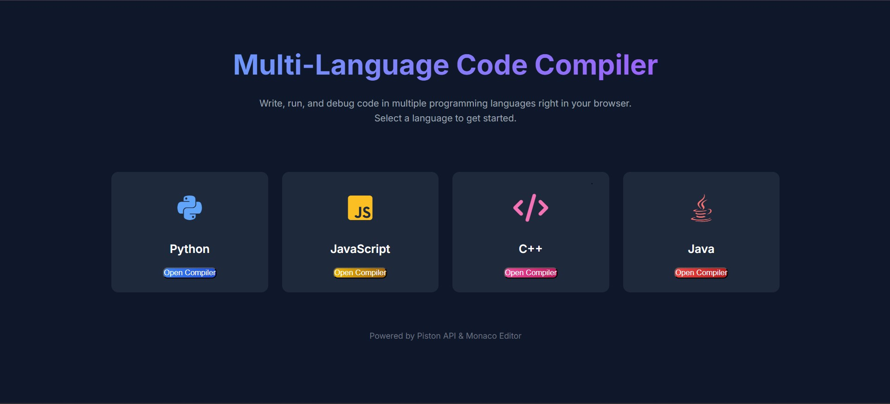
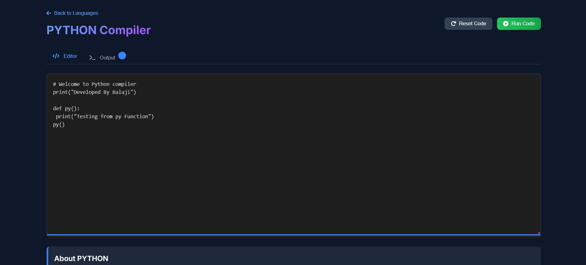
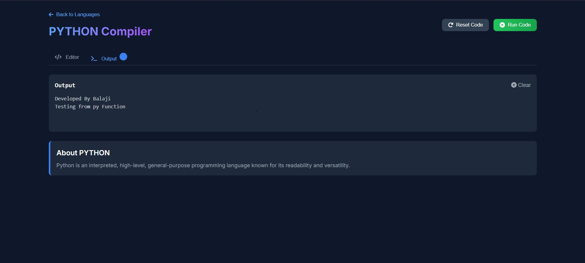

# 🚀 CodeNest - Online Code Compiler  

CodeNest is a simple and interactive **online code compiler** where users can select a programming language (Python, JavaScript, C++, Java) from the main page and start coding directly in the browser.  

---

## ✨ Features  
- 🖥️ Card-style main page with multiple languages.  
- ⚡ Instant compiler interface when a language is selected.  
- 📂 Organized project structure.  
- 🎨 Clean and user-friendly UI.  

---

## 🛠️ Tech Stack  
- **Frontend**: React, CSS, JavaScript  
- **Backend**: Piston API  
- **Compiler**: Piston API for code execution

## 🌴 Project File Structure   

```
src/
├── components/
│   ├── Home/
│   │   ├── Home.js – Renders the homepage UI
│   │   └── Home.css – Styles for the homepage
│   │
│   ├── Compiler/
│   │   ├── Compiler.js – Online compiler logic & UI
│   │   └── Compiler.css – Styles for compiler page
│   │
│   ├── Editor/
│   │   ├── Editor.js – Code editor integration
│   │   └── Editor.css – Styles for editor
│   │
│   └── NotFound/
│       ├── NotFound.js – 404 page handling
│       └── NotFound.css – Styles for NotFound page
│
├── services/
│   └── api.js – API functions for backend/compilation requests
│
├── constants/
│   └── codeTemplates.js – Default code templates for each language
│
├── App.js – Main app component
├── App.css – Global styles
└── index.js – Entry point of the React app
```

## 🚀 Installation  

1. Clone the repository  
   ```bash
   git clone https://github.com/Bala9840/CodeNest.git
   ```

2. Navigate to the project folder
   ```bash
   cd CodeNest
   ```

3. Install dependencies
   ```bash
   npm install
   ```

4. Run the project
   ```bash
   npm start
   ```

---

## 📸 Output

<div align="center">

  ### 🏠 Home Page
  

  ###  Compiler Page
  

  ###  Output Page
  

</div>

---

<p align="center">
  <a href="https://codesnest.netlify.app/" target="_blank" rel="noopener noreferrer">
    
  </a>
</p>

---

## 🔗 Source Code

[👉 GitHub Repository](https://github.com/Bala9840/CodeNest)

---

## 📄 License

This project is licensed under the MIT License - see the [LICENSE](LICENSE) file for details.

---

<p align="center">
  <strong>⭐ Star this repo if you found it helpful!</strong>
</p>
